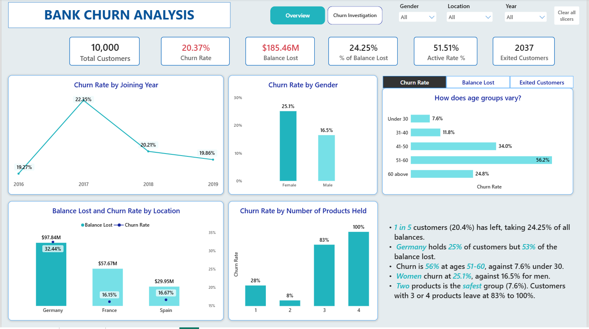
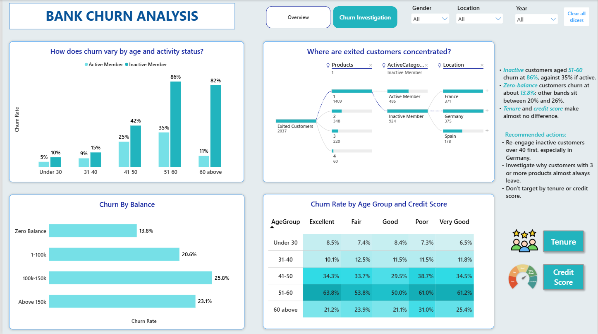

# Bank Churn Analysis (Power BI)

A two-page Power BI report on 10,000 bank customers. It shows how many customers left, how much balance left with them, and which customer segments churn the most.

I built this project from the ground up, starting with data cleaning in Power Query, designing a star-schema data model, creating DAX measures, and then turning the analysis into an interactive Power BI report.

## Business Problem

The bank lost 2,037 of its 10,000 customers, a churn rate of 20.37%. Those customers held 24.25% of all balances. I wanted to answer these questions:

- How big is churn overall, and how much balance does it take with it?
- Which age groups, genders and locations churn the most?
- Does activity status or the number of products held relate to churn?
- How do balance, tenure and credit score relate to churn?

This is a historical analysis. It shows which segments have churned more in the past. It does not predict which individual customers will leave.

## Tools

- Power BI Desktop
- Power Query
- DAX
- Star-schema data modeling
- Field parameter, bookmarks and decomposition tree
- Conditional formatting

## Data

The source file is `data/bank_churn_dataset.csv`. It has 10,007 rows and 14 columns: credit score, location, gender, age, tenure, balance, number of products, credit card status, activity status, estimated salary, joining date and whether the customer exited. After cleaning there are 10,000 unique customers.

The file has no exit date, no product names and no currency. The report shows amounts with a $ sign.

More detail on the dataset and the model is in [`data/dataset_and_star_schema.md`](data/dataset_and_star_schema.md).

## Approach

### 1. Data Cleaning in Power Query

The raw file had a few problems:

| Problem | Fix |
|---|---|
| 7 repeated rows | Removed, first occurrence kept |
| Stray text after the digits in 3 customer IDs | Kept the leading digits |
| `N` in the activity column | Recoded as inactive (0) |
| Blank or `na` in 5 balance values | Converted to numbers and treated as 0 |

I then added age groups, balance categories, credit score categories, the joining year, and sort columns so the categories appear in a natural order. I built these categories around the questions above, so the same fields work in the charts, the matrix and the decomposition tree.

### 2. Data Modeling — Star Schema

I then built a **star-schema model** in Power BI instead of using one large flat table for all analysis.

The central fact table is:

`fact_bank_churn`

It is connected to dimension tables for customer information, geography, gender, activity status, exit status, credit-card status, and date.

I also created separate helper tables for **DAX measures** and **parameters**.

### Star Schema

I built a star schema instead of one large flat table. The fact table is `fact_bank_churn`. It connects to dimension tables for customer information, geography, gender, activity status, exit status, credit card status and date. Two helper tables hold the DAX measures and the parameters.


The fact table holds the customer-level records. The dimension tables supply the attributes used to filter and segment them, so the same measures work across every dimension.

### 3. DAX Measures

Main measures:

- Total Customers
- Exited Customers
- Churn Rate
- Retention Rate
- Balance Lost
- % of Balance Lost
- Active Rate
- Average Customers Per Product

Measures respond to slicers and filters, so I did not need a separate calculation for each visual. A field parameter called Metric Selector lets the reader switch the age chart between churn rate, balance lost and exited customers.

### 4. Dashboard

**Page 1, Overview.** It shows the high-level picture:

- Cards for Total Customers, Churn Rate, Balance Lost, % of Balance Lost, Active Rate and Exited Customers
- Churn rate by joining-year cohort
- Churn rate by gender
- Churn by age group, with the metric switch described above
- Balance lost and churn rate by location
- Churn rate by number of products held
- A short text box of the main findings

**Page 2, Churn Investigation.** It goes deeper into segments:

- Churn by age group and activity status
- A decomposition tree of exited customers, split by products, activity status and location
- Churn by balance category
- A matrix of age group against tenure or against credit score, with two buttons and bookmarks to switch between them





---

## Key Findings

- Overall churn is **20.37%**: 2,037 of 10,000 customers. They held 24.25% of the total balance.
- Churn rises with age: 7.6% under 30, 11.8% at 31-40, 34.0% at 41-50 and 56.2% at 51-60. It drops to 24.8% above 60.
- Women churn at 25.1% and men at 16.5%.
- Germany has 32.4% churn, against 16.2% in France and 16.7% in Spain. Germany has about 25% of customers but 53% of the balance lost.
- Inactive customers leave far more often than active ones. In the 51-60 group, 86% of inactive customers left, against 35% of active customers.
- Customers with two products churn at 7.6%. One product gives 27.7%, three give 82.7%, and all customers with four products left. Only 266 customers hold three products and 60 hold four.
- Customers with a zero balance churn at 13.8%. The other balance groups range from 20.6% to 25.8%.
- Credit score, tenure and joining year change churn very little. It stays between about 19% and 22% across all of them.

## Limitations

- There is no exit date, so churn cannot be tracked over calendar time. Joining year is a cohort comparison, not a trend.
- Products are only a count. The data does not say which product a customer held.
- The three and four product groups are small, so those bars rest on few customers.
- The findings describe patterns in this dataset. They do not show what causes customers to leave.
- Five customers had no balance recorded and were treated as zero.

## What I Learned

- My first age chart showed exit counts, and the 41-50 group looked worst only because it was the largest. Switching to churn rate moved 51-60 to the top at 56.2%.
- Credit score and tenure looked like possible drivers. Both turned out almost flat, so I treated that as a result and not as a gap in the analysis.
- The three and four product groups have very high churn but few customers. I read them as something to investigate, not a conclusion.
- Planning the categories and sort columns during cleaning saved a lot of rework when I built the visuals.

## Repository Structure

```text
Bank-Churn Analysis/
│
├── README.md
│
├── data/
│   └── dataset_and_star_schema.md
│
├── images/
│   ├── overview.png
│   ├── churn_investigation.png
│   └── star_schema.png
│
└── Bank_Churn_Analysis.pbix
```

