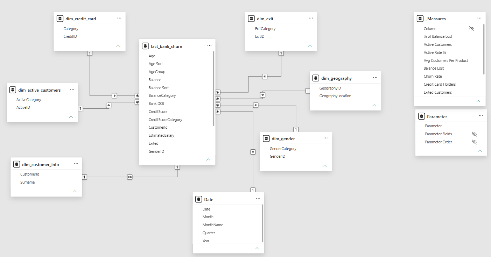

# Dataset and Star Schema

This file describes the data behind the Bank Churn report and how the Power BI model is built.

## Dataset

Each row is one bank customer. The raw file has 10,007 rows and 14 columns. After cleaning there are 10,000 unique customers, and 2,037 of them exited.

### Columns

| Raw column | What it holds | Used for |
|---|---|---|
| RowNumber | Row index | Not used in the analysis |
| CustomerId | Customer identifier | Counting unique customers |
| CreditScore | Credit score | Credit score categories |
| GeographyID | Location code: 1 France, 2 Spain, 3 Germany | Location analysis |
| GenderID | Gender code: 1 Male, 2 Female | Gender analysis |
| Age | Age in years | Age groups |
| Tenure | Years with the bank, from 3 to 7 | Tenure analysis |
| Balance | Account balance | Balance Lost and balance categories |
| NumOfProducts | Number of products held, from 1 to 4 | Product analysis |
| HasCrCard | 1 if the customer holds a credit card | Supporting segmentation |
| IsActiveMember | 1 active, 0 inactive | Active vs inactive analysis |
| EstimatedSalary | Estimated yearly salary | Supporting analysis |
| Exited | 1 if the customer left the bank | Churn flag |
| Bank DOJ | Joining date, day-month-year | Joining-year cohorts |

### Fields I added

**Age Group:** Under 30, 31-40, 41-50, 51-60, 60 above. A customer aged 30 falls in 31-40.

**Credit Score Category**

| Category | Score range |
|---|---|
| Excellent | 800 to 850 |
| Very Good | 740 to 799 |
| Good | 670 to 739 |
| Fair | 580 to 669 |
| Poor | 300 to 579 |

**Balance Category:** Zero Balance, 1-100K, 100K-150K, Above 150K.

**Joining Year:** taken from Bank DOJ. It runs from 2016 to 2019.

Each category also has a sort column, so charts show the groups in their natural order instead of alphabetical order. The groups feed the charts, the matrix and the decomposition tree.

## Data Quality

The raw file had a few problems, which I fixed in Power Query.

| Problem | Fix |
|---|---|
| 7 repeated rows | Removed, first occurrence kept |
| Stray text after the digits in 3 customer IDs | Kept the leading digits |
| `N` in the activity column | Recoded as inactive (0) |
| Blank or `na` in 5 balance values | Converted to numbers and treated as 0 |
| 1 blank tenure value | Left as it is, since tenure is not part of any KPI |

Treating a blank balance as 0 does not change Balance Lost, because zero adds nothing to a sum. It does put those five customers in the Zero Balance group.

## Star Schema

The model has one fact table in the centre and dimension tables around it.

### Fact table

`fact_bank_churn` holds the customer-level records. All the churn measures are calculated from it.

### Dimension tables

| Table | Holds | Key |
|---|---|---|
| `dim_customer_info` | Customer ID and surname | CustomerId |
| `dim_geography` | Location names | GeographyID |
| `dim_gender` | Gender names | GenderID |
| `dim_active_customers` | Active and inactive labels | ActiveID |
| `dim_exit` | Exited and retained labels | ExitID |
| `dim_credit_card` | Credit card labels | CreditID |
| `Date` | Calendar dates | Date |

### Helper tables

- `_Measures` stores the DAX measures.
- `Parameter` stores the Metric Selector field parameter, which lets the reader switch the age chart on page 1 between churn rate, balance lost and exited customers.

### Relationships

Each dimension sits on the one side and `fact_bank_churn` on the many side, except `dim_customer_info`, which is one to one because each customer appears once.

| Dimension | Joins to the fact table on |
|---|---|
| `dim_customer_info` | CustomerId |
| `dim_geography` | GeographyID |
| `dim_gender` | GenderID |
| `dim_active_customers` | IsActiveMember |
| `dim_exit` | Exited |
| `dim_credit_card` | HasCrCard |
| `Date` | Bank DOJ |

### Model view



## Why a Star Schema

A star schema keeps descriptive attributes in small tables and customer records in one large table. That makes the model easier to read and lets one measure work across many fields.

```DAX
Exited Customers =
CALCULATE(
    [Total Customers],
    fact_bank_churn[Exited] = 1
)
```

```DAX
Churn Rate =
DIVIDE(
    [Exited Customers],
    [Total Customers]
)
```

I define these measures once. Every chart then uses the same definition of churn, whether it splits by gender, location, activity status, age group, tenure, credit score category or product count.

## Data Limitations

- There is no exit date. Churn cannot be tracked over calendar time, and joining year is a cohort, not a trend.
- Products are only a count. The data does not say which product a customer held.
- There is no currency field. The report shows amounts with a $ sign.
